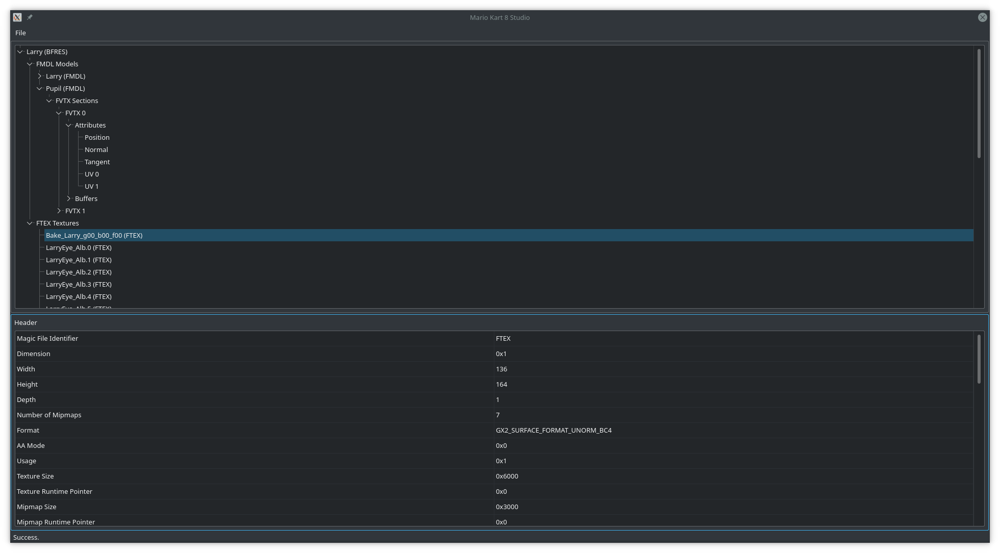
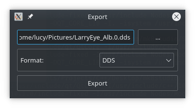
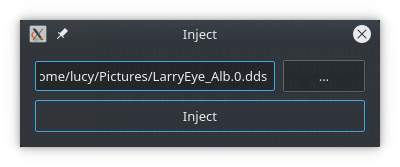

# Mario Kart 8 Studio
As the grandiose name of this tool suggests, Mario Kart 8 Studio was a project of mine with tall goals. I wanted to make an editor for Mario Kart 8, one to pull the scene out of its grave, and facilitate the creation of content for Mario Kart 8. My goal was to create a usable editor which works across all platforms, and is completely open source.

Needless to say, this was never realized. However, this project still has a very special place in my heart. This was really my first foray into writing an actual program. I have never known exactly how much I don't know about programming, for nobody does. But building a tool like this has given me much direction into what I need to learn. In addition to the learning experience, I take pride in what I do have to show here. MK8Studio supports opening decompressed BFRES files, exporting, and injecting textures, for a very limited set of texture formats. It's a little janky, but I'm happy that it has gotten this far.

At this point in time, we now have [Switch-Toolbox](https://github.com/KillzXGaming/Switch-Toolbox), a wonderful editor which serves the needs of the MK8 modding scene and more. I still wish to preserve this repository, since it is so near and dear to me.

Main UI:



Exporting a Texture:



Injecting a Texture:



## Build
MK8Studio can be built from the command line using `qmake`. For example, on *nix:
```
mkdir Build
cd Build
qmake ../Source
make
```
Alternatively, you can open up `Source/MK8Studio.pro` in Qt Creator and build it using that.

## Thanks
I give my thanks to the wonderful Dolphin developers, whose project I have referenced countless times for a reference for good design and practices, the Decaf and Mesa teams for ADDRLib, StapleButter for some of the IO code used, Exzap for helping me with decoding GX2 textures, and AboodXD for creating GTX Extractor and helping me with decoding GX2 textures
